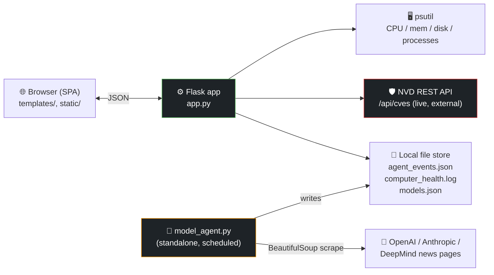

<div align="center">

# 🖥️ Desktop Health Agent

**A self-hosted, single-process observability dashboard for a local machine.**

[](https://www.python.org/)
[](https://flask.palletsprojects.com/)
[](https://github.com/giampaolo/psutil)
[](https://nvd.nist.gov/developers)
[](https://www.crummy.com/software/BeautifulSoup/)
[](#-license)

</div>

---

It exposes a small Flask/JSON API over system telemetry (`psutil`), correlates it with a background-collected log/event stream, and enriches the view with two external data feeds — live CVE data from NIST's NVD and a rolling index of AI model releases collected by a separate scraping agent. Built as a lightweight, dependency-light alternative to standing up a full monitoring stack (Prometheus/Grafana, etc.) for single-machine use cases.

## 📑 Contents

- [Architecture](#-architecture)
- [API surface](#-api-surface)
- [Design notes](#-design-notes)
- [Repo layout](#-repo-layout)
- [Getting started](#-getting-started)
- [Engineering debt / roadmap](#-engineering-debt--roadmap)
- [License](#-license)

## 🏗️ Architecture



> [!NOTE]
> The dashboard process (`app.py`) is **read-only** with respect to disk — it only tails/reads `agent_events.json`, `computer_health.log`, and `models.json`, never writes them. `model_agent.py` is a decoupled producer that runs on its own schedule (cron / Task Scheduler) and owns the write path, which keeps the request-serving process fast and avoids file-lock contention between a scraper and a live dashboard.

## 🔌 API surface

All endpoints return JSON and are read-only (`GET`).

| Endpoint | Source | Behavior / error handling |
|---|---|---|
| `GET /` | `templates/index.html` | Renders the SPA shell |
| `GET /api/system` | `psutil` | CPU %, memory %, disk % (cross-platform via `Path.home().anchor`); wrapped in try/except → `500` with error payload on failure |
| `GET /api/processes` | `psutil.process_iter` | Top 20 processes by CPU%, sorted descending; per-process `NoSuchProcess`/`AccessDenied` are swallowed so one dying process doesn't 500 the whole call |
| `GET /api/activity` | `agent_events.json` | Last 50 events, newest first; missing file → `[]`, malformed JSON → `500` with details |
| `GET /api/logs` | `computer_health.log` | Last 100 lines, classified as `INFO`/`WARNING`/`ERROR` by substring match, newest first |
| `GET /api/cves` | NVD REST API (`services.nvd.nist.gov`) | Last 7 days of published CVEs, sorted by publish date; walks CVSS v4.0 → v3.1 → v3.0 → v2 metric groups to find a usable score/severity; distinguishes timeout (`504`) from unreachable (`502`) from bad payload (`502`) |
| `GET /api/models` | In-process curated list (or `models.json` from the agent) | Releases from the last 3 years, sorted by date descending |

## 🧠 Design notes

- **Graceful degradation over hard failure.** Every I/O boundary (file reads, `psutil` calls, the NVD HTTP call) is wrapped so a missing file or an unreachable third-party API degrades that one widget instead of taking down the process.
- **CVSS fallback chain.** NVD doesn't guarantee which CVSS version a given CVE has scored metrics for, so `/api/cves` tries v4.0 first and falls back down to v2 rather than assuming a schema.
- **Duplicate detection in the scraper.** `model_agent.py` normalizes model names (`[^a-z0-9]` stripped, lowercased) before comparing against `models.json`, so "Claude 3.5 Sonnet" and "claude-3.5-sonnet" aren't recorded twice.
- **Time-boxed retention.** Both the curated model list and the scraped one are filtered to a rolling 3-year window (`LOOKBACK_YEARS`) on every write, so `models.json` doesn't grow unbounded.
- **Separation of collection and serving.** Keeping `model_agent.py` out of the request path (see Architecture) means a slow or failing scrape of an external news page never blocks a dashboard request.

## 📂 Repo layout

```
Desktop-Health-Agent/
├── app.py               # Main Flask app — dashboard + all API endpoints
├── desktop_health.py    # Earlier/alternate version of the dashboard (simpler, no curated model feed)
├── model_agent.py       # Standalone scraper that discovers new AI model releases and writes models.json
├── templates/           # HTML template(s) for the dashboard
├── static/              # CSS/JS assets for the dashboard
└── .gitignore
```

> [!TIP]
> `app.py` and `desktop_health.py` overlap heavily — `app.py` is the more complete, more defensive version (it handles missing files, cross-platform disk paths, and adds the model feed). If you're just getting started, run `app.py`.

## 🚀 Getting started

**Requirements:** Python 3.9+

No `requirements.txt` is committed yet, so install dependencies manually:

```bash
pip install flask psutil requests beautifulsoup4
```

1. Clone the repo:
   ```bash
   git clone https://github.com/aditya-srinivas-ganti/Desktop-Health-Agent.git
   cd Desktop-Health-Agent
   ```
2. Run the dashboard:
   ```bash
   python app.py
   ```
3. Open your browser to `http://127.0.0.1:5000`.

<details>
<summary><strong>Running the model-release agent</strong></summary>

<br>

`model_agent.py` is a separate script, meant to be run periodically (e.g. via a scheduled task or cron job), that scrapes OpenAI, Anthropic, and Google DeepMind's news pages, deduplicates against `models.json`, and logs its activity to `computer_health.log`:

```bash
python model_agent.py
```

It keeps only releases from the last 3 years (`LOOKBACK_YEARS` in the script) and writes results to `models.json` in the project root, which the dashboard can be extended to read from.

</details>

## 🛠️ Engineering debt / roadmap

<details>
<summary><strong>Expand for known gaps and next steps</strong></summary>

<br>

- **No dependency manifest.** `requirements.txt` / `pyproject.toml` isn't committed yet — dependencies (`flask`, `psutil`, `requests`, `beautifulsoup4`) currently have to be inferred from imports.
- **Dev server in production mode.** `app.run(debug=True)` is fine for local use but shouldn't be exposed beyond localhost; a production deploy would want `waitress`/`gunicorn` and `debug=False`.
- **Duplicate implementations.** `desktop_health.py` is an earlier iteration of `app.py` (and hardcodes the `C:\` drive, so it's Windows-only); it should be deleted or merged once `app.py` is confirmed as the source of truth.
- **Scraper fragility.** `model_agent.py`'s `extract_articles()` does keyword/regex matching against raw HTML rather than a structured API, so it's coupled to the current markup of the OpenAI/Anthropic/DeepMind news pages and will silently under-detect if they change layout.
- **No automated tests.** All of the above (especially the CVSS fallback chain and the scraper's date/name parsing) would benefit from unit tests before further feature work.
- **No auth/rate limiting.** All endpoints are unauthenticated `GET`s — fine for `127.0.0.1`, not fine if this is ever bound to `0.0.0.0`.

</details>

## 📄 License

No license has been specified yet. Add a `LICENSE` file if you intend for others to use or contribute to this project.
